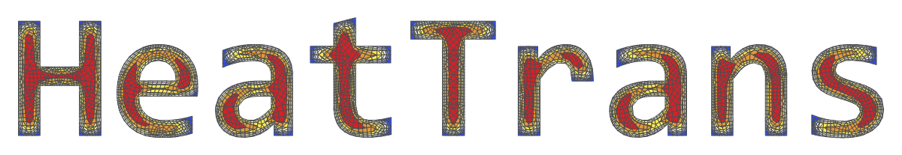
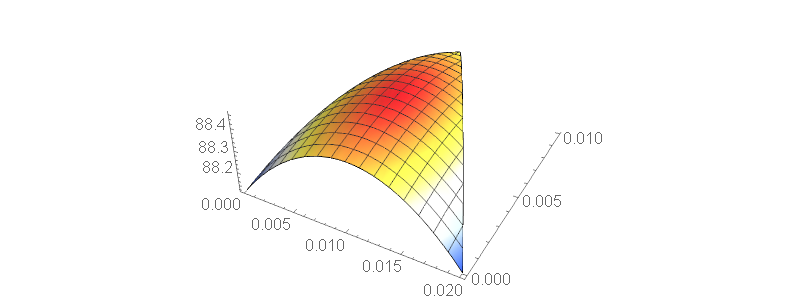

# HeatTrans

[](https://github.com/c3m-labs/HeatTrans/releases)
[](http://semver.org/spec/v2.0.0.html)

[Mathematica](http://www.wolfram.com/mathematica/) package for non-stationary heat transfer simulation
with [AceFEM](http://symech.fgg.uni-lj.si/) framework.



## Installation

The following description is for people who just want to use the package functionality and are not interested in package development.

To use _HeatTrans_ package you need Mathematica version 11.1 or later and
AceFEM package, version 6.912 or later ([trial](http://symech.fgg.uni-lj.si/Download.htm) version).
Supported operating systems are 64-bit Windows, MacOS and Linux.

_HeatTrans_ package is released in the `.paclet` file format, which contains code, documentation and other necessary resources.
Download the latest `.paclet` file from the [repository "releases" page](https://github.com/c3m-labs/HeatTrans/releases)
to your computer and install it by evaluating the following command in the Mathematica:

```mathematica
(* This is usually loaded automatically at kernel startup. *)
Needs["PacletManager`"]

(* Download .paclet file from repository "releases" page. *)
PacletInstall["full/path/to/HeatTrans-X.Y.Z.paclet"]
```

This will permanently install the _HeatTrans_ package to `$UserBasePacletsDirectory`.
To update the documentation it may be necessary to restart Mathematica.
Mathematica will always use the latest installed version of package and all installed versions
can be enumerated by evaluating `PacletFind["HeatTrans"]`.
You can get more detailed information about the package with `PacletInformation["HeatTrans"]`.
All versions can be uninstalled with:

```mathematica
PacletUninstall["HeatTrans"]
```


## Usage

After you have installed the package, load it to Mathematica session with `Get`.
Then you can, for example, calculate temperature distribution over triangular steel bar after 60 seconds
using the main function `HeatTransfer`.

```mathematica

Get["HeatTrans`"]

region = Triangle[{{0,0},{1,1},{2,0}}/100];
endTime = 60;
material = <|"Conductivity" -> 55, "Density" -> 7800, "SpecificHeat" -> 470|>;

(* InterpolatingFunction[...] object is returned. *)
result = HeatTransfer[region, endTime, material]

Plot3D[
    result[endTime, x, y],
    Element[{x, y}, result["ElementMesh"] ],
    ColorFunction -> "TemperatureMap",
    AspectRatio -> Automatic,
    Boxed -> False,
    PlotRange -> All
]
```



To access the documentation, open the notebook interface help viewer and search for _HeatTrans_.

## Contributing and bug reports

The main purpose of _HeatTrans_ package is to test and demonstrate good software development
[practices](https://doi.org/10.1371/journal.pbio.1001745) using Mathematica and AceFEM framework.
Therefore, there is less focus on building more advanced FEM modelling capabilities.

Please use this repository [issues](https://github.com/c3m-labs/HeatTrans/issues) page to submit bugs or feature ideas.
Contributions to this repository are very welcome.
Guidelines on how to build `.paclet` file from the source code can be found in [Development.md]( Development.md ) file.
